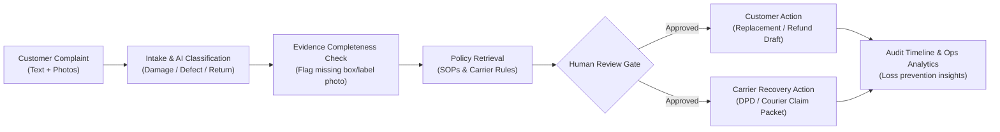

# ClaimFlow: Claims Resolution & Recovery Hub
## Step-by-Step Luo.app Build Playbook & Prompt Guide

This playbook provides the exact sequence of prompts, data structures, and instructions to build, configure, and demonstrate the **Claims Resolution & Recovery Hub** inside **Luo.app**.

---

## Quick Reference Workflow



---

## Phase 1: Onboarding & Master Initialization

### Step 1.1: Welcome Screen Setup
1. In the initial onboarding screen (*"What kind of work do you do?"*), select **E-commerce** or **Operations**.
2. If prompted for team size or integrations, choose **Small Team (1–10)** and click **Continue** (or **Skip to Workspace**).

### Step 1.2: Send the Master Initialization Prompt
Paste the following command directly into the Luo chat bar:

```text
Build an internal application called "Claims Resolution & Recovery Hub". 
Its purpose is to help e-commerce operations teams resolve customer returns, shipping damages, and warranty complaints from one unified control room, while automatically preparing recovery claims against carriers and suppliers.

Create database entities for:
1. Customer Cases (Case ID, Customer Name, Email, Language, Order Reference, Channel, Status, Case Type, Severity, Created At)
2. Attachments (Attachment ID, Case ID, File Name, Image Category [Product, Packaging, Shipping Label, Invoice], Status)
3. Orders (Order ID, Order Date, SKU, Product Name, Item Value, Currency, Sales Channel, Customer ID)
4. Shipments (Shipment ID, Order ID, Carrier [DPD, Packeta, DHL, GLS], Tracking Number, Delivery Date, Delivery Status)
5. Policy Documents (Policy ID, Title, Category [Return, Warranty, Carrier Claim], Version, Content Summary)
6. Resolution Proposals (Proposal ID, Case ID, Recommended Action [Replacement, Refund, Store Credit, Reject], Rationale, Confidence Score, Estimated Cost)
7. Recovery Drafts (Recovery ID, Case ID, Counterparty [Carrier or Supplier], Counterparty Name, Claim Reason, Estimated Recoverable Amount, Status [Draft, Pending Review, Submitted, Recovered])
8. Human Approvals (Approval ID, Case ID, Action Type, Reviewer Name, Decision [Approved, Approved With Edits, Rejected], Notes, Timestamp)
9. Audit Events (Event ID, Case ID, Event Type, Actor, Description, Timestamp)
10. Insight Records (Record ID, SKU, Product Name, Carrier Name, Issue Type, Frequency, Total Loss Amount)

Build a clean dashboard displaying:
- Open Cases requiring attention
- Cases Waiting for Missing Evidence
- Cases Awaiting Human Approval
- Total Potential Recovery Value (€)
- Repeated Issue Analytics by SKU and Carrier
```

---

## Phase 2: Refining the Core Modules

Once Luo generates the initial structure, run these sequential refinement prompts to lock in the operational logic.

### Step 2.1: Case Detail & Evidence Checklist View
Prompt to send to Luo:

```text
In the Customer Case detail view, create a two-column layout:
- Left Column: Customer Complaint details, original message, order & shipment info (carrier, tracking, SKU, purchase price), and uploaded photo gallery categorized by photo type.
- Right Column: 
  1. Evidence Completeness Checklist: Automatically evaluate if the case has:
     - [ ] Clear photo of damaged product
     - [ ] Photo of external shipping box showing damage
     - [ ] Photo of shipping label with visible barcode/tracking number
     - [ ] Proof of purchase / invoice
  2. If any evidence item is missing, show an alert: "Incomplete Evidence for Carrier Claim" and generate a pre-drafted polite email requesting the missing photos from the customer in their language.
```

### Step 2.2: Dual-Action Generation Engine
Prompt to send to Luo:

```text
For every damaged goods or carrier complaint case, generate two distinct action proposals under a "Proposed Actions" tab:

1. Action A (Customer-Facing):
   - Propose an immediate customer resolution based on policy (e.g., Free Express Replacement or Refund).
   - Draft a polite, empathetic customer reply in the customer's language.

2. Action B (Recovery-Facing):
   - Prepare a formal Carrier Damage Claim packet for the assigned carrier (e.g., DPD, DHL, Packeta).
   - The packet must include: Tracking Number, Delivery Timestamp, Incident Description, Item Value, Invoice Reference, and list of attached evidence photos.
   - Calculate the "Recoverable Loss Amount".

Add a clear notice: "Requires Human Approval before dispatch."
```

### Step 2.3: Human-in-the-Loop Approval Gate
Prompt to send to Luo:

```text
Add an Approval Action Bar at the top of the Case Detail view with three buttons:
1. [Approve Both & Dispatch]: Approves customer resolution draft and queues the carrier claim packet.
2. [Edit Drafts]: Allows the operator to modify customer reply text or claim amount before approving.
3. [Reject / Escalate]: Allows rejecting the claim or assigning to senior management with a mandatory reason note.

Every decision must record an immutable log entry in the Audit Events timeline with timestamp, user name, and prior state.
```

---

## Phase 3: Injecting Demo Scenarios

Feed these pre-made test scenarios to verify that the app behaves correctly and is ready for live demonstration.

### Step 3.1: Seed Scenario 1 — "The Broken Glass Vase" (High Recovery Potential)
Prompt to send to Luo:

```text
Create a demo sample case in the database with the following data:
- Case ID: #CAS-2026-089
- Customer Name: Elena Rostova
- Email: elena.rostova@example.com
- Language: English
- Order Reference: #ORD-9842
- SKU: HOME-VASE-GL-01 (Handmade Venetian Glass Vase)
- Order Value: €89.00
- Carrier: DPD
- Tracking Number: DPD-SK-8492019482
- Delivery Date: Yesterday (24 hours ago)
- Complaint Text: "Hello, I just opened the parcel delivered by DPD yesterday. The vase is completely shattered into pieces! This was supposed to be a birthday gift for tomorrow. Please help immediately."
- Attached Photo: 1 photo showing broken glass pieces on a table.
- Evidence Status: 
  - Product damage photo: PRESENT
  - Outer box photo: MISSING
  - Shipping label photo: MISSING
- System Analysis: Case Type = "Shipping Damage", Missing Evidence = "Outer box & shipping label needed for DPD 48-hour claim deadline".
- Proposed Customer Action: Send immediate replacement via priority courier.
- Proposed Recovery Action: DPD Carrier Claim for €89.00 (Pending box photo).
```

### Step 3.2: Seed Scenario 2 — "Wrong T-Shirt Size" (Standard Return)
Prompt to send to Luo:

```text
Create a second demo sample case:
- Case ID: #CAS-2026-090
- Customer Name: Martin Horvath
- Email: martin.h@example.sk
- Language: Slovak
- Order Reference: #ORD-9755
- SKU: APP-TEE-BLK-L (Organic Cotton T-Shirt Black - L)
- Order Value: €32.00
- Carrier: Packeta
- Complaint Text: "Dobrý deň, objednal som si veľkosť L, ale v balíku bolo tričko s visačkou XL. Chcem ho vymeniť za správnu veľkosť."
- Case Type: "Wrong Item Delivered (Warehouse Picking Error)"
- Evidence Status: Photo of neck tag showing XL provided (COMPLETE).
- Proposed Customer Action: Free prepaid return label + dispatch correct size L.
- Proposed Recovery Action: Internal warehouse fulfillment discrepancy flag (No carrier claim).
```

---

## Phase 4: Ops Analytics & Root Cause View

Prompt to send to Luo:

```text
Create an "Ops Insights & Loss Recovery" dashboard page with:
1. Stat Cards:
   - Total Claims This Month (€3,420)
   - Successfully Recovered from Carriers (€2,150 — 62.8% recovery rate)
   - Active Pending Claims (€1,270)
   - Average Resolution Time (4.2 hours)
2. Breakdown Table:
   - "Top Damaged SKUs": Showing SKU HOME-VASE-GL-01 with 12 incidents this month (Recommendation: Review bubble wrap packaging standards).
   - "Carrier Damage Rates": DPD (3.8% damage rate on fragile items) vs DHL (0.9% damage rate).
```

---

## Phase 5: The 5-Minute Live Demo Script

When demonstrating this project (to judges, clients, or investors), follow this strict sequence:

| Minute | Screen / Action | What to Say / Demonstrate |
|---|---|---|
| **0:00 – 0:45** | **Dashboard** | *"Small e-commerce brands lose thousands of euros monthly on broken goods because filing carrier claims takes too long and evidence is lost. Here is Claims Resolution & Recovery Hub."* |
| **0:45 – 1:45** | **Open Case #CAS-2026-089** | Show the shattered vase photo. Point out the **Evidence Checker**: *"Notice how the AI immediately flagged that the outer carton photo is missing—without it, DPD denies the claim."* |
| **1:45 – 2:45** | **The Dual Action** | Show Action A (Customer replacement draft in English) and Action B (Formal DPD claim packet for €89.00). *"One complaint triggers two synchronized business operations."* |
| **2:45 – 3:30** | **Human Approval** | Click **Approve**. Show the live update in the **Audit Timeline**: recorded with timestamp and operator name. |
| **3:30 – 4:30** | **Ops Insights Page** | Show the recurring damage analytics for the vase and courier comparison: *"The software doesn't just resolve claims—it shows management which products need better packaging and which couriers are breaking packages."* |
| **4:30 – 5:00** | **Conclusion** | *"Faster customer resolution, more money recovered from couriers, and complete human control."* |

---

## Troubleshooting & Fine-Tuning Prompts

If Luo generates something imperfect, use these quick fix prompts:

- **If the layout looks too plain or text-heavy:**
  > *"Improve the UI styling: add status badges with colors (Green for Resolved/Approved, Red for Urgent/Missing Evidence, Amber for Pending Review), clean card borders, and icon indicators for carriers (DPD, DHL, Packeta)."*

- **If Luo didn't generate the recovery packet properly:**
  > *"Make sure the Carrier Recovery Draft looks like a printable claim summary document with explicit fields: Carrier Claim Reference, Tracking Number, Damaged Items Breakdown, Attached Photos checklist, and Total Claim Value in EUR."*

- **If you need Slovak/Czech language samples:**
  > *"Add a language toggle or multi-language preview showing how customer replies can be generated in Slovak, Czech, German, or English based on the customer's initial message."*
